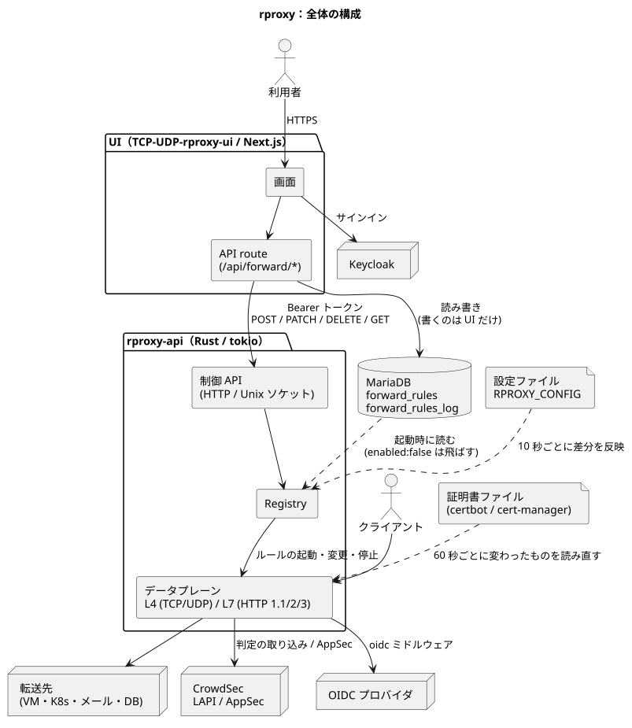
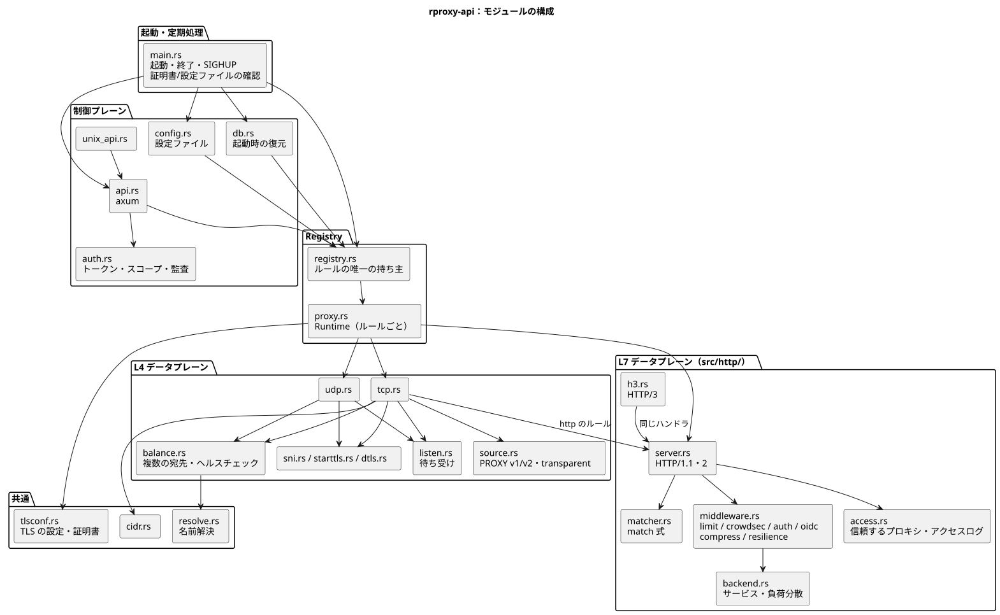
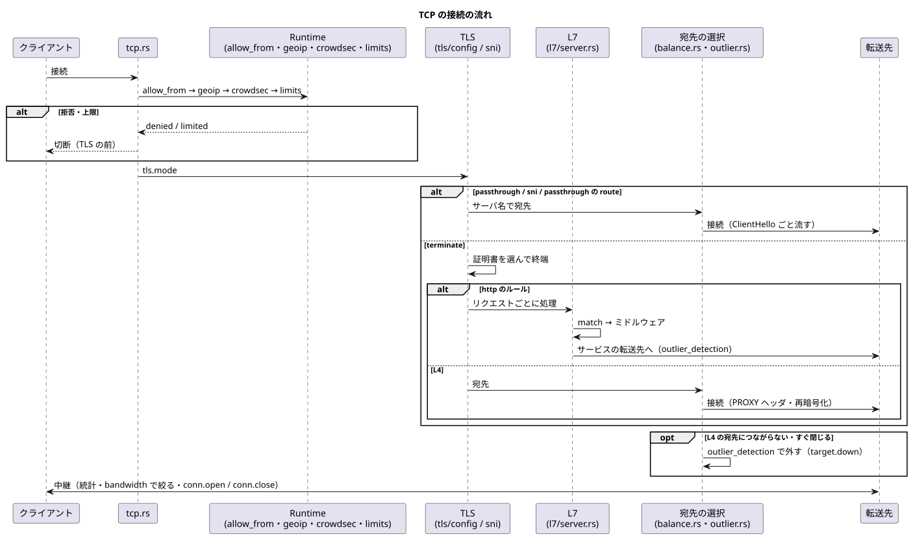
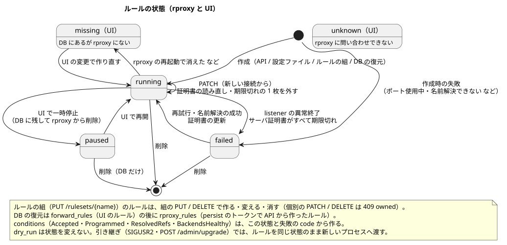

# 構成図

PlantUML のソース（`*.puml`）と、そこから作った SVG です。構成を変えたら `.puml` を直して、`scripts/render-diagrams.sh` で SVG を作り直してください。

```bash
PLANTUML_SERVER=http://<PlantUML サーバ> scripts/render-diagrams.sh   # PlantUML サーバで描く
scripts/render-diagrams.sh                                          # plantuml コマンド（または PLANTUML_JAR）で描く
```

| 図 | 内容 |
|---|---|
| [overview.svg](overview.svg) | 全体（UI・DB・rproxy・設定ファイル・証明書・転送先・CrowdSec・OIDC） |
| [internals.svg](internals.svg) | rproxy-api のモジュールの構成（制御プレーン・Registry・L4 / L7 のデータプレーン・共通） |
| [connection.svg](connection.svg) | TCP の 1 つの接続の流れ（allow_from・CrowdSec → TLS → L4 / L7 → 転送先） |
| [rule_state.svg](rule_state.svg) | ルールの状態（rproxy の running / failed、UI の paused / missing / unknown） |





